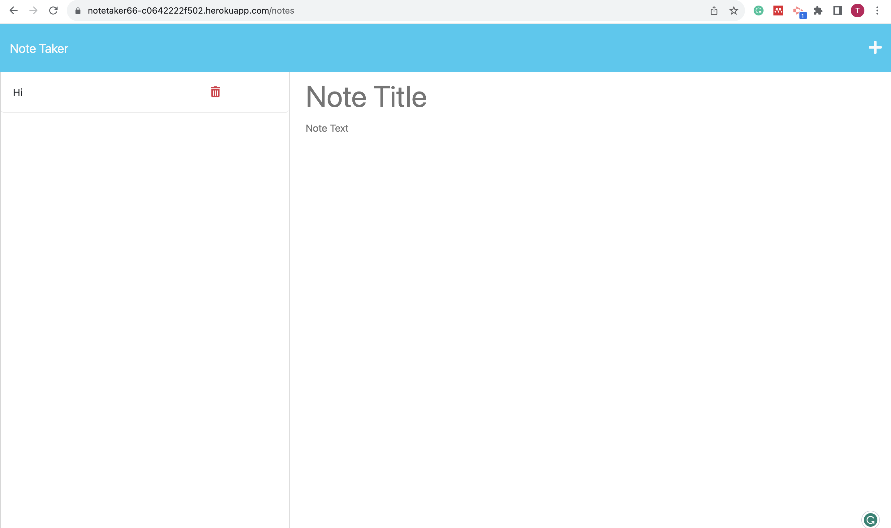

# Note Taker

## Description

Note Taker is a simple web application that allows users to write, save, and manage their notes. It uses an Express.js back end to handle API routes and store note data in a JSON file.

![Note Taker Screenshot]

## Table of Contents

- [Installation](#installation)
- [Usage](#usage)
- [API Routes](#api-routes)
- [Demo](#demo)

## Installation

1. Clone the repository to your local machine.
2. Navigate to the project directory in your terminal.
3. Install the required dependencies by running the command:

   ```bash

   ```

## Usage

1. To start the application, run the following command:

- bash:
- Run node server.js

2. Open your web browser and go to http://localhost:3001 to access the Note Taker application.

3. Click on the "Get Started" button to navigate to the notes page, where you can create, view, and delete notes.

4. To create a new note, click on the pencil icon in the top-right corner, enter the note title and text, and click the save icon.

5. To view an existing note, click on the note in the left-hand column.

6. To delete a note, click on the trash icon next to the note in the left-hand column.

## API Routes

- GET /api/notes: Retrieves all saved notes as JSON.
- POST /api/notes: Receives a new note to save on the request body, adds it to the notes, and returns the new note.
- DELETE /api/notes/:id: Receives the ID of a note to delete, removes the note from the notes, and returns a success message.

## Demo

You can find a live demo of the application deployed on Heroku here
https://notetaker66-c0642222f502.herokuapp.com/notes.
